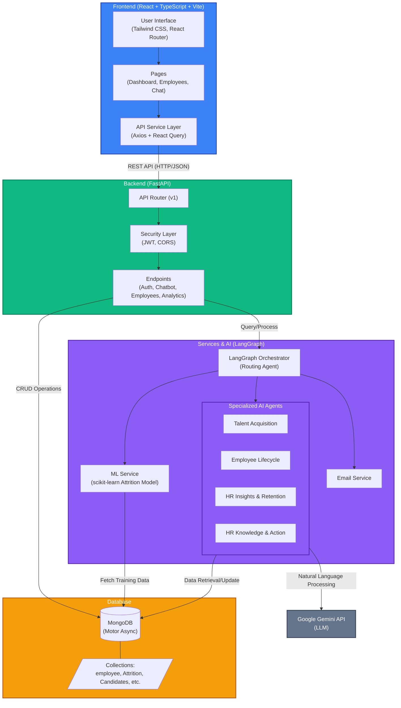

# System Architecture Diagram

This diagram outlines the high-level architecture of the **TalentFlow** HR Agent Platform, detailing the interaction between the React frontend, FastAPI backend, AI/ML services (LangGraph & Gemini), and the MongoDB database.

### Architecture Components Breakdown

1. **Frontend**: Built with React, TypeScript, and Vite. It communicates with the backend via Axios and React Query, offering a modern UI with Tailwind CSS. It handles routing and displays dashboards, employee details, and the chatbot interface.
2. **Backend**: Powered by FastAPI. It handles routing, security (JWT authentication, CORS), and exposes RESTful endpoints for the frontend to consume.
3. **Services & AI (LangGraph)**: The core intelligence of the application. LangGraph orchestrates the workflow by taking user queries and routing them to specialized agents (e.g., Talent Acquisition, HR Insights). It utilizes Google's Gemini API for natural language understanding and invokes ML models (scikit-learn) for predictions like employee attrition.
4. **Database**: MongoDB handles data persistence asynchronously using the Motor driver. It stores information across various collections like employees, attendance, performance, and candidates.
